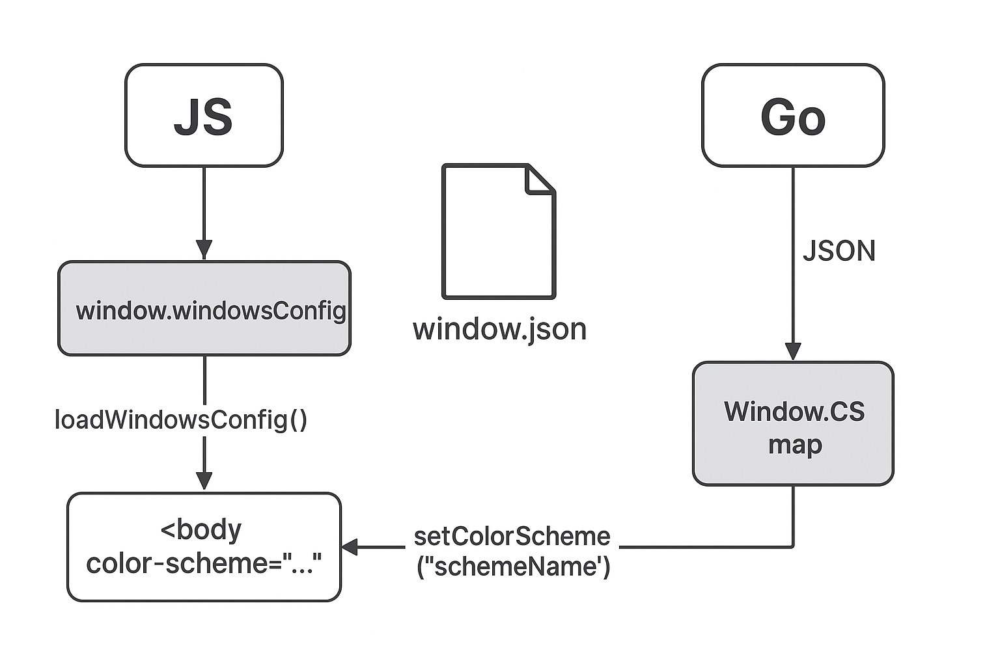

Old. Need to learn better method for building conf.



```
+------------------+                       +----------------------+
|   window.json     |   <-- Read/Write -->  |      Go (a.wcfg)     |
| (user config dir) |                       |  Window.CS map       |
+------------------+                       +----------------------+
           ^                                         ^
           |                                         |
           |                                         |
           |                                         |
           v                                         v
+------------------+                       +----------------------+
|   JS (Frontend)  |                       |  Go App Struct       |
| window.windowsConfig <-----------------> |  App.wcfg.CS         |
+------------------+                       +----------------------+
           ^
           |
           |  loadWindowsConfig()
           |
           v
   <body color-scheme="...">       (attribute reflects active scheme)
           ^
           |
           |  setColorScheme("schemeName")
           |
           v
   JS updates window.windowsConfig → sends to Go UpdateWindowConfig()
           |
           v
   Go updates a.wcfg.CS and writes JSON back to user config
```